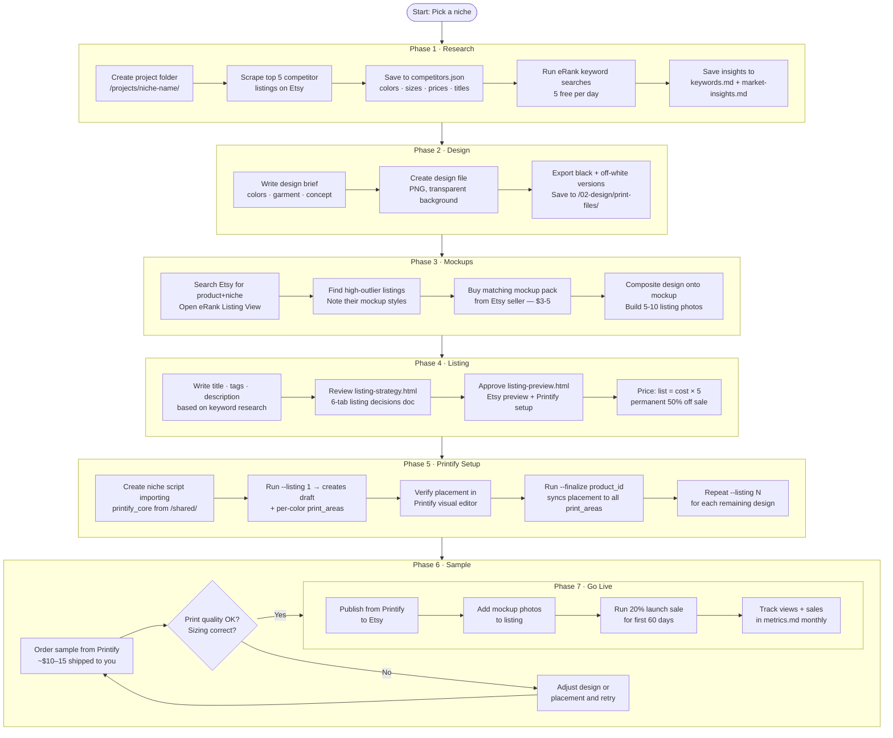

# Etsy POD Launcher — AI-Assisted Workflow

Launch a print-on-demand product on Etsy using AI to handle research, listing copy, and Printify setup. You make the creative decisions; the AI does the data work.

---

## Getting Started

**First time?** → Follow [SETUP.md](SETUP.md) to install tools and configure your API keys. It takes about 15 minutes.

## What You Need Before Starting

| Tool | What it's for | Cost |
|---|---|---|
| [Claude Code](https://claude.ai/code) | Your AI assistant — runs the whole workflow | Paid plan |
| [Printify](https://printify.com) | Print provider — creates and ships your products | Free |
| [Etsy](https://etsy.com/sell) | Where you sell | Free + listing fees |
| [eRank](https://erank.com) | Real Etsy keyword search volumes | Free (5 searches/day) |
| [Firecrawl](https://www.firecrawl.dev) | Scrapes competitor listings | Free tier available |

---

## The 9 Phases

```
Phase 1 → Research      Find out what's selling and what keywords buyers use
Phase 2 → Design        Create the print file based on research
Phase 3 → Mockups       Research + build proven Etsy listing photos
Phase 4 → Listing       Write title, tags, description, and price
Phase 5 → Printify      Create products via script, verify placement, finalize
Phase 6 → Sample        Order one shirt to check quality before going live
Phase 7 → Go Live       Publish to Etsy, set sale, configure automations
Phase 8 → Diagnostics   Fix the right thing based on which metric is broken
Phase 9 → Scale         Multiply winners across mockup styles and niches
```

---

## Full Workflow Flowchart



---

## What AI Does vs What You Do

| Step | You | AI |
|---|---|---|
| Pick niche | ✅ | |
| Scrape competitors | | ✅ Playwright browser automation |
| Analyse colors, sizes, pricing | | ✅ Reads competitors.json |
| Keyword research | You log into eRank | ✅ Extracts data from page |
| Design | ✅ Creative decision | ✅ Can help generate brief |
| Mockup research | You browse eRank Listing View | ✅ Advises on mockup criteria |
| Build listing photos | ✅ Composite design onto mockup | |
| Upload to Printify | | ✅ Via API |
| Fix print placement | | ✅ Reads + copies via API |
| Reduce variants to ≤100 | | ✅ Via API |
| Write title + tags | | ✅ Based on real keyword data |
| Calculate pricing | | ✅ Cost × 5 list / 50% sale |
| Order sample | ✅ | |
| Publish to Etsy | ✅ One click in Printify | |
| Review performance | ✅ Monthly check-in | ✅ Helps interpret data |

---

## Project Folder Structure

```
/projects/<niche-name>/
  01-research/
    competitors.json      ← scraped competitor data (source of truth — includes demand signals, image URLs)
    competitor-report.html ← two-tab HTML report: Tab 1 = Market Insights (from market-insights.md), Tab 2 = Competitor card grid; regenerate via scripts/generate-competitor-report.py
    keywords.md           ← keyword volumes from eRank
    market-insights.md    ← patterns, gaps, what to copy/avoid
    scrapes/              ← raw firecrawl output (auto-written by research script)
  02-design/
    brief.md              ← design spec
    print-files/          ← DTG print PNGs for Printify (black + off-white versions, transparent bg)
  03-mockups/             ← Etsy listing photos (mockup packs + composited images)
  04-listing/
    titles.md             ← title options
    descriptions.md       ← description draft
    tags.md               ← all 13 Etsy tags
    pricing.md            ← margin calculations
    listing-snapshot.md   ← what's actually live vs. draft (source of truth for push status)
    listing-strategy.html ← 6-tab decision doc (Strategy, Titles, Tags, Price, Colors, Personalization); generated before creation script runs
    listing-preview.html  ← Etsy listing preview + Printify setup; final approval gate before creation script
  scripts/                ← project-specific API scripts (e.g. create-[niche]-listings.py; imports printify_core)
  05-live/
    listings.md           ← published Etsy URLs
  06-performance/
    metrics.md            ← monthly views/sales log

/shared/
  printify_core.py        ← reusable Printify API library; imported by all niche creation scripts
  supplier-notes.md       ← Printify placement values per blank (reuse across projects)
  etsy-seo-rules.md       ← Etsy title/tag rules
  knowledge/              ← POD research, course insights, strategy reference
    strategies-reference.md
    insights/
    transcripts/

/scripts/
  research-competitors.py      ← shared tool: scrapes Etsy competitors via Firecrawl
  generate-competitor-report.py ← generates two-tab competitor-report.html from competitors.json + market-insights.md (any niche)
  calculate_placement.py       ← calculates x/y/scale from design image + print area dimensions; supports calibration and JSON output
  extract-competitors-prompt.md ← paste to Claude when building competitors.json from scrapes
```

---

## Key Rules to Never Break

1. **Never guess competitor data** — always scrape it first and read competitors.json
2. **Always verify print placement visually** before copying to other products
3. **≤100 variants** on Etsy — Gildan 5000 has 255 by default, cut it down
4. **60% margin minimum** — list = cost × 5, permanent 50% off sale = effective sell price at cost × 2.5
5. **Order a sample** before going live — what looks good in mockup may differ in print
6. **Tag 1 = highest search volume keyword** — eRank tells you which one that is

---

## Quick Start (for a brand new niche)

1. Create the folder: `projects/your-niche-name/01-research/` through `05-performance/`
2. Tell the AI: *"I want to launch a [product type] on Etsy. Research the top 5 competitors."*
3. Log into eRank, tell the AI to extract keyword data
4. Create your design, save to `/02-design/print-files/`
5. Tell the AI: *"Create a Printify product with this design"*
6. Follow through Phases 3–6

See [WORKFLOW.md](WORKFLOW.md) for the detailed step-by-step instructions for each phase.

---

## Your Projects

Your niche folders live in [projects/](projects/). Each folder follows the same structure: 01-research → 02-design → 03-mockups → 04-listing → 05-live → 06-performance.

To start your first project, open this folder in Claude Code and say:
> "I want to launch a [product type] on Etsy. Help me research the top 5 competitors."

See [CHANGELOG.md](CHANGELOG.md) for version history.
